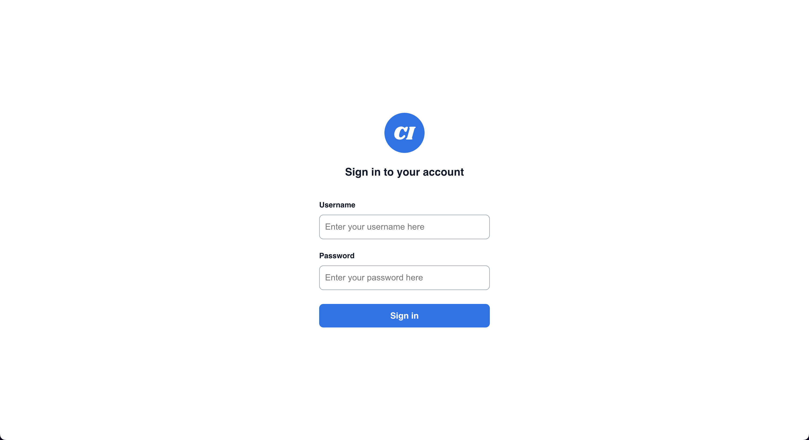
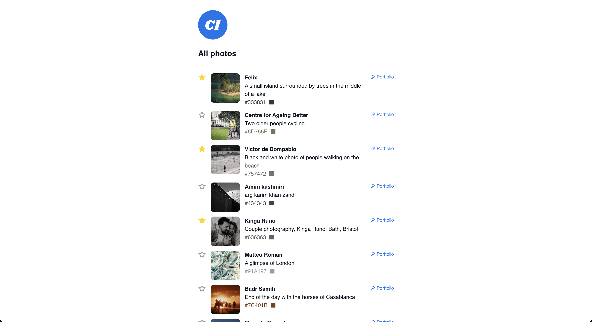

<h1 align="center">
	📷 Photo Gallery 🖼️
</h1>

	<i>A fullstack project with React and Flask.</i>

	
	
	
	
	

<h3 align="center">
	<a href="#%EF%B8%8F-about">About</a>
	 · 
	<a href="#%EF%B8%8F-usage">Usage</a>
	 · 
	<a href="-work-log">Work log</a>
</h3>

---

## 🗣️ About

A minimal website app for displaying a photo gallery. Stack:

- **Front-end:** Typescript, React, Vite, Vitest, Testing Library.
- **Back-end:** Python, Flask, Postgres, SQLAlchemy, JWT, Docker, Pytest.

## 🛠️ Usage

Refer to the README files inside the `client` and `server` folders.

## 📄 Work log

### 0. Pre-work

- [x] [client] Research most up-to-date ways of creating a React app and choose the best fit
- [x] [server] Decide on the backend stack

### 1. Create client app with mocked funcionality

- [x] [client] Create app using Vite + React + TS
- [x] [client] Create sign-in page UI (with mock sign-in validation)
- [x] [client] Create navigation layer + navigate to (empty) photo gallery page from sign-in
- [x] [client] Create photo gallery page UI (with mock data and starring behavior in local state)

### 2. Create api to serve mocked data + connect client to api

- [x] [server] Create api with Flask
- [x] [server] Create `/users/sign-in` endpoint to serve mocked token
- [x] [client] Authenticate user on sign-in page
- [x] [server] Create protected `/photos` endpoint to serve mocked data (imported from JSON)
- [x] [client] Fetch photo data from server (with authorization)
- [x] [server] Create `/photos/star` endpoint to create and remove photo stars
- [x] [client] Add request to add/remove photo stars

### 3. Set up database

- [x] [server] Set up database on api
- [x] [server] Create `User` tabule + update controllers + create admin user on app start
- [x] [server] Create `Pthoto` table + update controllers
- [x] [server] Create `PhotoStar` table + update controllers

### 4. Testing and linting

- [x] [client] Add testing
- [x] [client] Set up linter and formatter
- [x] [server] Add testing
- [x] [server] Set up linter and formatter
